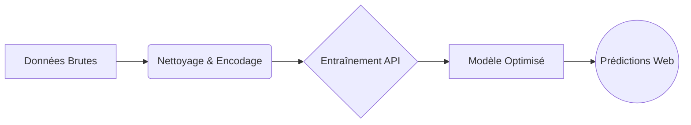

# 🏡 Projet Machine Learning : Prédiction Immobilière

> [!TIP]
> **Objectif** : Développer une IA capable d'estimer le prix des maisons avec précision en se basant sur leurs caractéristiques techniques.

---

## 🛠️ Stack Technique

| Domaine | Technologie | Rôle |
| :--- | :--- | :--- |
| **Langage** | **Python 3.x** 🐍 | Cœur du système |
| **Logic** | **Scikit-Learn** 🧠 | Algorithmes ML (Random Forest) |
| **Backend** | **Flask** 🌶️ | API REST pour servir le modèle |
| **Frontend** | **HTML5 / CSS3** 🎨 | Interface utilisateur "Glassmorphism" |

---

## 1. 🧬 Le Pipeline Data Science

Notre approche suit un processus rigoureux pour transformer les données brutes en intelligence exploitable.

### 📋 Analyse du Dataset
Nous travaillons sur le dataset `Housing` qui comprend les features suivantes :

*   🏠 **Structure** : Surface (`area`), Chambres (`bedrooms`), Salles de bain (`bathrooms`), Étages (`stories`).
*   ✨ **Confort** : Climatisation (`airconditioning`), Eau chaude (`hotwaterheating`).
*   📍 **Localisation** : Zone préférentielle (`prefarea`).

> [!NOTE]
> Nous avons utilisé une **Heatmap** pour identifier les corrélations fortes.

_**Fig 1.** Les cases rouges indiquent une forte corrélation positive (ex: plus la surface est grande, plus le prix est élevé)._

---

## 2. 🧠 Le Cœur du Réacteur : Random Forest

Nous avons choisi l'algorithme **Random Forest Regressor**. C'est une méthode d'ensemble qui combine la "sagesse" de multiples arbres de décision pour une précision accrue.

### 📐 La Mathématique derrière la Magie

La prédiction finale $\hat{y}$ est la moyenne des arbres :

$$ \hat{y} = \frac{1}{N} \sum_{i=1}^{N} h_i(x) $$

Pour évaluer notre succès, nous utilisons le **RMSE (Root Mean Square Error)** :

$$ RMSE = \sqrt{\frac{1}{n} \sum_{i=1}^{n} (y_i - \hat{y}_i)^2} $$

> [!IMPORTANT]
> Plus le RMSE est bas, plus nos prédictions sont proches de la réalité.

> [!IMPORTANT]
> Plus le RMSE est bas, plus nos prédictions sont proches de la réalité.

### 📈 Courbe d'Apprentissage
Pour vérifier si notre modèle apprend correctement de l'augmentation des données :

_**Fig 2bis.** Les courbes d'entraînement (rouge) et de validation (vert) convergent, indiquant que le modèle n'est pas en surapprentissage majeur._

---

## 3. 📊 Visualisation des Performances

### Ce qui compte vraiment (Feature Importance)
L'IA a déterminé quels facteurs influencent le plus le prix.

_**Fig 2.** Sans surprise, la **surface (area)** est le critère #1, suivi par le nombre de salles de bain._

### Précision : Réalité vs Prédiction
Avons-nous visé juste ?

_**Fig 3.** L'alignement des points sur la diagonale montre une excellente capacité de prédiction._

### Analyse des Erreurs (Résidus)
Vérifions si nos erreurs sont aléatoires (ce qui est bon signe).

_**Fig 4.** La courbe en cloche centrée sur 0 valide la robustesse de notre modèle._

_**Fig 5.** Nuage de points des résidus. L'absence de structure évidente confirme que les erreurs sont bien aléatoires._

---

## 4. 🚀 Conclusion

Ce projet démontre la puissance du Machine Learning appliqué à l'immobilier.

*   ✅ **Modèle Robuste** : Capable de généraliser sur de nouvelles maisons.
*   ✅ **Interface Moderne** : Simple d'utilisation pour l'utilisateur final.
*   ✅ **Extensible** : Prêt à intégrer de nouvelles données géographiques.

---
_Généré par Antigravity AI_ 🤖
